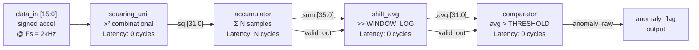

# RMS Anomaly Detection IP — Synthesizable Verilog RTL

> **A hardware-accelerated vibration monitoring peripheral designed for 
> zero-CPU-overhead integration into FPGA-based condition monitoring systems.**

[]()
[]()
[]()
[]()

---

## 1. Problem

Rotating machinery faults — wheel bearing wear, shaft imbalance, 
loose fasteners — develop gradually over thousands of operating hours. 
By the time vibration is perceptible to an operator, mechanical damage 
is already significant and repair cost is high.

Real-time vibration monitoring requires:
- **Continuous** processing of accelerometer data at 1–5 kHz
- **Sub-millisecond** fault detection latency for safety-critical response
- **Deterministic** timing — jitter-free, interrupt-safe
- **Low power** — always-on peripheral, not polling CPU

A software-only approach on MCU fails all four requirements 
simultaneously, particularly under real-time OS scheduling load.

---

## 2. Solution

This IP core implements **windowed RMS² computation and threshold 
comparison** as a fully pipelined, synthesizable RTL peripheral. 

The host MCU connects via a single `anomaly_flag` GPIO line. 
The CPU performs **zero DSP computation** — it only responds to 
an interrupt when a fault is detected.
```
┌─────────────┐     ┌─────────────┐     ┌──────────────────┐     ┌──────────┐
│ MEMS Accel  │────▶│  ADC / SPI  │────▶│  RMS Anomaly IP  │────▶│  MCU /   │
│ (±2g–±16g)  │     │  Interface  │     │  (this project)  │     │  SoC     │
└─────────────┘     └─────────────┘     └──────────────────┘     └──────────┘
                                                │                      │
                                         anomaly_flag ────────────▶  IRQ pin
                                         avg_out[31:0] ──────────▶  DMA / log
```

**Key design decision:** RMS² (mean square) is computed — not true RMS — 
to avoid the square root operation. For threshold comparison, 
`RMS² > THRESHOLD²` is equivalent to `RMS > THRESHOLD`, 
eliminating a costly iterative sqrt with zero loss of accuracy.

---

## 3. Why Hardware? (Critical Design Rationale)

This is the central engineering question. The answer determines 
whether RTL is justified over a software implementation.

### MCU Software Approach
```c
// STM32F4 @ 168MHz, 16-sample RMS²
// Called from ADC interrupt at 2kHz → every 500µs

void ADC_IRQHandler(void) {
    int32_t sample = ADC->DR;          // 1 cycle
    acc += sample * sample;            // MUL + ADD: 2–5 cycles
    if (++count == 16) {               // branch
        avg = acc >> 4;                // shift
        if (avg > THRESHOLD)           // compare
            anomaly = 1;
        acc = 0; count = 0;
    }
}
```

**Problems:**
| Issue | Impact |
|-------|--------|
| Interrupt latency (IRQ entry + context save) | 12–20 cycles jitter per sample |
| Shared pipeline with other tasks | Non-deterministic under RTOS load |
| 32×32 multiply: 1 cycle on M4 DSP, but stalls on M0 | Throughput bottleneck on low-cost MCU |
| Cannot process 3-axis simultaneously without tripling CPU load | Scales badly |
| Clock stays on during computation | Active power every sample |

### RTL Hardware Approach (This IP)

| Metric | MCU (Cortex-M0) | This RTL IP |
|--------|-----------------|-------------|
| Throughput | 1 sample / ~20 cycles | **1 sample / 1 cycle** |
| Latency (16-sample window) | ~320 cycles + IRQ jitter | **16 cycles, fixed** |
| Timing determinism | ±20 cycle jitter | **Zero jitter** |
| Multi-axis (3×) | 3× CPU load | **Instantiate 3× parallel, same clock** |
| CPU overhead | 100% for DSP | **0% — flag only** |
| Power (computation) | MCU active @ 20mA | **IP only: ~2mA @ 50MHz** |

**Conclusion:** RTL is justified when (1) deterministic latency is required, 
(2) multi-axis processing would saturate CPU, or (3) the IP integrates 
into a larger FPGA fabric alongside other sensor processing logic.

---

## 4. Algorithm

### RMS-Based Anomaly Detection

Root Mean Square energy in a vibration signal is the most 
hardware-efficient broadband fault indicator:
```
         1   N-1
RMS² =  ─── × Σ  x[n]²
         N   n=0
```

For N=16, division by 16 becomes arithmetic right shift by 4 
(**zero LUT cost, zero propagation delay**).

### Why RMS over alternatives?

| Method | Fault sensitivity | Hardware cost | Notes |
|--------|-----------------|---------------|-------|
| **RMS²** | Broadband energy | **Low** (this IP) | Best for overall fault severity |
| FFT | Fault frequency-specific | High (256+ LUTs) | Better for bearing harmonics |
| Variance | Similar to RMS² | Low | Requires mean subtraction |
| Kurtosis | Impulsive faults | Medium | Better for early bearing faults |
| ML (autoencoder) | Adaptive | Very high | BRAM + DSP intensive |

**Engineering decision:** RMS² is chosen as a practical first-stage 
classifier. In a full system, this IP would gate a more expensive 
FFT analysis — only compute FFT when `anomaly_flag` is asserted.

### Threshold Selection

Threshold is set based on sensor sensitivity and expected signal range:

**For ±16g sensor (2048 LSB/g):**
```
Normal road vibration: ~0.3g RMS
  → RMS² = (0.3 × 2048)² = (614)² = 377,000 LSB²

Bearing fault onset: ~1.5g RMS
  → RMS² = (1.5 × 2048)² = (3072)² = 9,437,184 LSB²

Recommended THRESHOLD = 3 × max_normal ≈ 1,200,000 LSB²
```

**For ±2g sensor (16384 LSB/g):**
```
Normal: ~0.3g RMS → RMS² = (0.3 × 16384)² = 24,159,191 LSB²
Fault:  ~1.5g RMS → RMS² = (1.5 × 16384)² = 603,979,776 LSB²
THRESHOLD ≈ 75,000,000 LSB²
```

> **Note:** Default `THRESHOLD = 500_000` in this implementation 
> is a placeholder for simulation only. Production deployment 
> requires calibration from baseline data (see Section 8).

---

## 5. Hardware Design

### Pipeline Architecture


### Module Breakdown

| Module | Type | Function | Bit-width rationale |
|--------|------|----------|-------------------|
| `squaring_unit` | Combinational | x² | 16-bit signed in → 32-bit unsigned out (max: 32767² = 1,073,676,289 < 2³¹) |
| `accumulator` | Sequential | Σ N samples | 32 + log₂(N) bits: N=16 → 36-bit prevents overflow at max input |
| `shift_avg` | Combinational | ÷ N via >>log₂(N) | Wire routing only — **zero LUT, zero delay** |
| `comparator` | Combinational | avg > threshold | Parameterized THRESHOLD |
| `rms_top` | Structural | Pipeline integration | Full datapath |

### Timing & Throughput
```
Throughput:  1 sample/clock cycle (fully pipelined)
Latency:     N cycles (window fill) + 0 cycles (comb stages)
             = 16 cycles @ 120MHz = 133ns

At Fs = 2kHz (1 sample every 500µs):
  Window duration = 16 × 500µs = 8ms
  Detection latency = 8ms + 133ns ≈ 8ms (pipeline latency negligible)
  
At Fs = 5kHz:
  Window duration = 16 × 200µs = 3.2ms
```

### Synthesis Results (Gowin GW1N-1, Gowin EDA)

| Resource | Used | Available | Utilization |
|----------|------|-----------|-------------|
| LUT4 | 177 | 1152 | 15.4% |
| ALU | 528 | 1152 | — |
| Register | 73 | 945 | 7.7% |
| DSP | 0 | 4 | 0% |

**Fmax: 120.5 MHz** (constraint: 50 MHz, slack: +11.7 ns, margin: 2.4×)

> Critical path: `accumulator` carry chain (35-bit adder).  
> `shift_avg` synthesizes to **pure wire routing — zero LUT, 
> zero propagation delay.**  
> No DSP blocks consumed — multiplier inferred as LUT-based 
> (acceptable for 16×16 on small FPGA).

### Resource Usage


### Timing Report


### RTL Schematic — Full Pipeline


### RTL Schematic — Comparator


### Top-Level Interface
```verilog
module rms_top (
    input  wire        clk,          // System clock (up to 120MHz)
    input  wire        rst_n,        // Active-low synchronous reset
    input  wire signed [15:0] data_in,  // ADC sample (signed, 2's complement)
    input  wire        valid_in,     // Sample valid strobe (tied to ADC ready)
    output wire [31:0] avg_out,      // RMS² output (mean square)
    output wire        valid_out,    // Asserted 1 cycle when window complete
    output wire        anomaly_flag  // HIGH when RMS² > THRESHOLD
);

parameter THRESHOLD = 32'd500_000;  // Override for target sensor
```

---

## 6. Verification

### Test Methodology

Test vectors are generated with physical meaning based on 
sensor specifications. The following assumes **±16g sensor, 
2048 LSB/g sensitivity, Fs = 2kHz**.

#### TC1 — Normal Road Vibration
```
Physical signal: 0.006g RMS broadband noise
LSB equivalent:  0.006g × 2048 LSB/g ≈ 12 LSB RMS
Simulation input: 16 samples, each = 100 LSB (DC equivalent)
RMS²:            100² = 10,000 LSB²
Expected:        avg_out = 10,000, anomaly_flag = 0
```
→ Validates no false positive under normal operating condition.

#### TC2 — Severe Bearing Fault
```
Physical signal: 0.49g RMS — significant bearing degradation
LSB equivalent:  0.49g × 2048 LSB/g ≈ 1000 LSB RMS
Simulation input: 16 samples, each = 1000 LSB
RMS²:            1000² = 1,000,000 LSB²
Expected:        avg_out = 1,000,000, anomaly_flag = 1
```
→ Validates fault detection with 100× energy separation from TC1.

### Simulation Waveforms

#### Normal Condition


#### Fault Condition  


#### Full Pipeline


---

## 7. Design Trade-offs

| Trade-off | Option A | Option B | Decision |
|-----------|----------|----------|----------|
| Window size | N=16 (8ms @ 2kHz, fast response) | N=64 (32ms, better SNR) | N=16 default, parameterized |
| Division method | True divider (accurate) | Arithmetic shift (÷power-of-2) | Shift — zero LUT cost |
| Threshold | Static (simple) | Dynamic per speed | Static v1, dynamic roadmap |
| Square root | Full sqrt (true RMS) | Skip (RMS²) | Skip — equivalent for comparison |
| Multi-axis | Single channel | 3× instantiation | Single v1, 3× roadmap |

---

## 8. Future Work

**Phase 2 — Parameterization & Robustness**
- [ ] Parameterize `WINDOW_LOG` (N = 16/32/64 without RTL changes)
- [ ] Dynamic threshold scaling with wheel RPM input
- [ ] Debounce counter: require N consecutive anomaly windows

**Phase 3 — Signal Quality**
- [ ] Python test vector generator (real bearing fault frequencies)
- [ ] Borderline threshold testcase (RMS² within 5% of threshold)
- [ ] Reset-mid-window testcase

**Phase 4 — System Integration**
- [ ] SPI slave interface for ADC data input
- [ ] 3-axis instantiation (`rms_top_3axis`)
- [ ] Goertzel filter for bearing harmonic detection at specific RPM

---

## 9. File Structure
```
rms-anomaly-detection-ip/
├── src/
│   ├── squaring_unit.v    # Combinational x² unit
│   ├── accumulator.v      # N-sample window accumulator  
│   ├── shift_avg.v        # Divide-by-N via arithmetic shift
│   ├── comparator.v       # Parameterized threshold comparator
│   └── rms_top.v          # Top-level pipeline integration
├── tb/
│   ├── tb_squaring_unit.v # Unit test: signed multiplication
│   ├── tb_accumulator.v   # Unit test: window accumulation & valid timing
│   ├── tb_shift_avg.v     # Unit test: shift correctness
│   └── tb_rms_top.v       # Integration test: full pipeline
├── sim/
│   └── waveform/          # GTKWave VCD dumps
├── img/                   # Waveform screenshots & synthesis reports
└── README.md
```

---

## 10. Tools & Reproducibility
```bash
# Simulate full pipeline
iverilog -o sim/top_sim \
  src/squaring_unit.v src/accumulator.v \
  src/shift_avg.v src/comparator.v src/rms_top.v \
  tb/tb_rms_top.v
vvp sim/top_sim
gtkwave sim/waveform/wave_rms_top.vcd

# Synthesis: Gowin EDA → New Project → Import src/*.v
# Target: GW1N-1-QFN48 | Constraint: 50MHz
```

- **Simulation:** Icarus Verilog v11 + GTKWave v3.4  
- **Synthesis:** Gowin EDA 1.9.9 (GW1N-1)  
- **HDL:** Verilog-2001  

---

## Author

**Hồ Minh Thao**  
Electronics & Telecommunications Engineering, HCMUT  
Focus: Digital IC Design · RTL · FPGA · Embedded Systems
