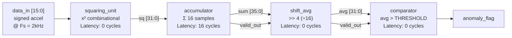
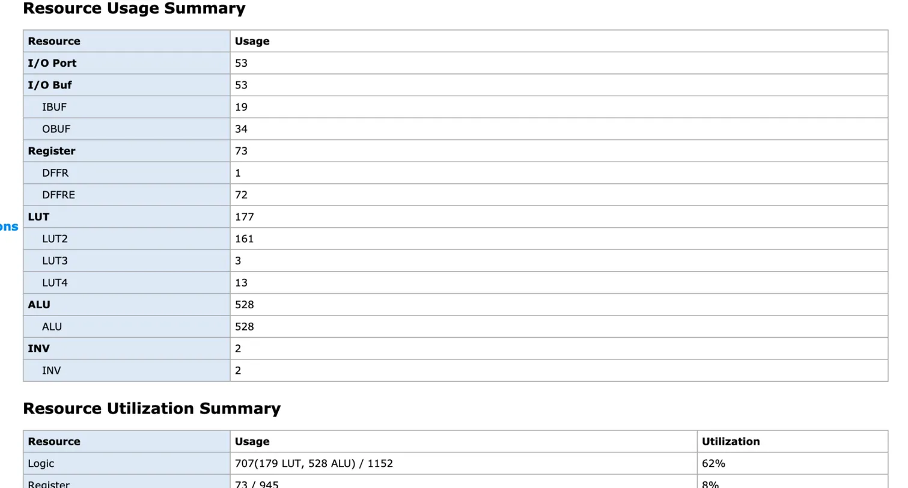
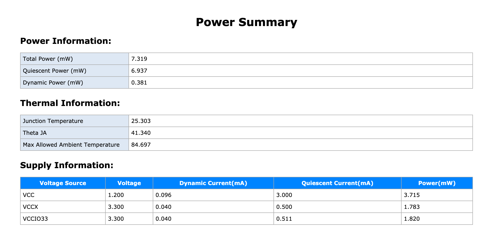
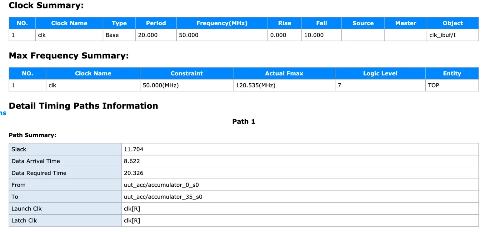
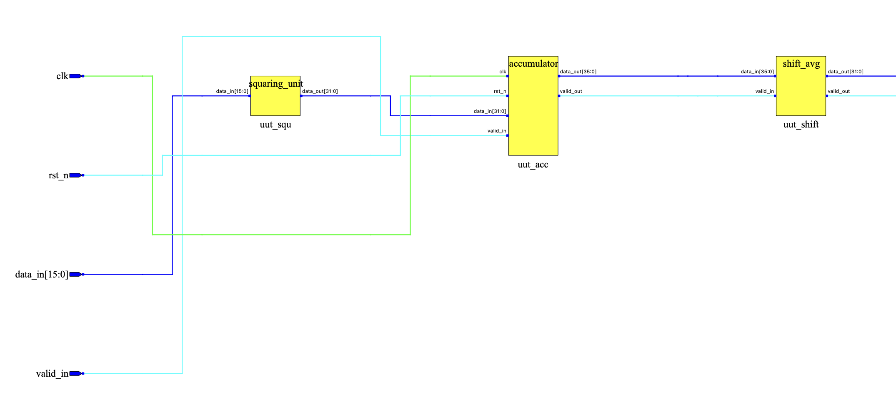
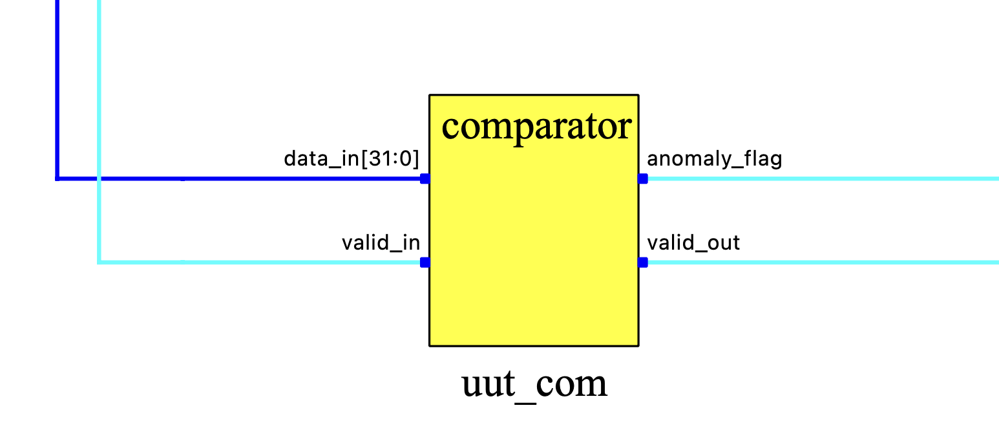
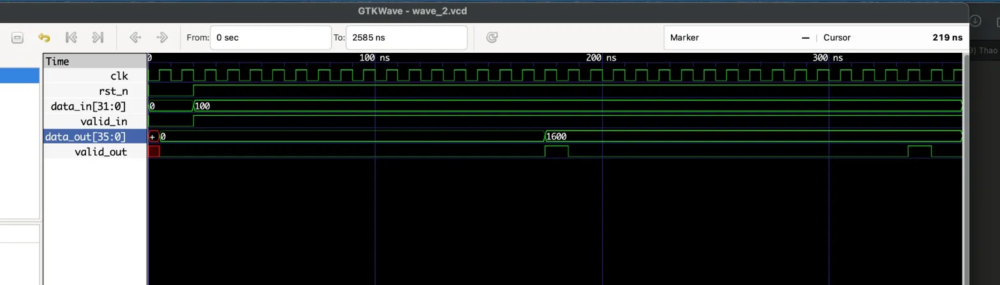

# RMS Anomaly Detection IP — Synthesizable Verilog RTL

> **A synthesizable Verilog peripheral that offloads continuous vibration 
> monitoring from the host CPU entirely. Processes accelerometer data at 
> 1 sample/cycle throughput with fixed 16-cycle latency — delivering 
> deterministic fault detection that no RTOS-scheduled software 
> implementation can match.**

[]()
[]()
[]()
[]()

---

## 1. Problem

Rotating machinery faults — wheel bearing wear, shaft imbalance, loose 
fasteners — develop gradually over thousands of operating hours. By the 
time vibration is perceptible to an operator, mechanical damage is already 
significant and repair cost is high.

Real-time vibration monitoring requires:
- **Continuous** processing of accelerometer data at 1–5 kHz
- **Sub-millisecond** fault detection latency for safety-critical response
- **Deterministic** timing — jitter-free, interrupt-safe
- **Low power** — always-on peripheral, not polling CPU

A software-only approach on MCU fails all four requirements simultaneously, 
particularly under real-time OS scheduling load.

---

## 2. Solution

This IP core implements **windowed RMS² computation and threshold comparison** 
as a fully pipelined, synthesizable RTL peripheral.

The host MCU connects via a single `anomaly_flag` GPIO line. 
The CPU performs **zero DSP computation** — it only responds to an interrupt 
when a fault is detected.
```
┌─────────────┐     ┌─────────────┐     ┌──────────────────┐     ┌──────────┐
│ MEMS Accel  │────▶│  ADC / SPI  │────▶│  RMS Anomaly IP  │────▶│  MCU /   │
│ (±2g–±16g)  │     │  Interface  │     │  (this project)  │     │  SoC     │
└─────────────┘     └─────────────┘     └──────────────────┘     └──────────┘
                                                │                      │
                                         anomaly_flag ────────────▶  IRQ pin
                                         avg_out[31:0] ──────────▶  DMA / log
```

**Key design decision:** RMS² (mean square) is computed — not true RMS — 
to avoid the square root operation. For threshold comparison, 
`RMS² > THRESHOLD²` is equivalent to `RMS > THRESHOLD`, eliminating 
a costly iterative sqrt with zero loss of detection accuracy.

---

## 3. Why Hardware?

### The MCU software approach
```c
// Cortex-M0 @ 48MHz, called from ADC interrupt at 2kHz (every 500µs)
void ADC_IRQHandler(void) {
    int32_t s = ADC->DR;
    acc += s * s;             // MUL: 1 cycle on M4, 32 cycles on M0
    if (++count == 16) {
        avg = acc >> 4;
        anomaly = (avg > THRESHOLD);
        acc = 0; count = 0;
    }
}
```

**Fundamental problems:**

| Issue | Impact |
|-------|--------|
| IRQ entry + context save | 12–20 cycle jitter per sample — non-deterministic |
| Cortex-M0: no hardware multiplier | 32-cycle MUL blocks pipeline |
| RTOS task scheduling | Interrupt may be delayed under load |
| 3-axis simultaneous | Triples CPU load — often not feasible |
| CPU active every sample | Prevents deep sleep, increases power |

### RTL hardware approach (this IP)

| Metric | MCU (Cortex-M0 @ 48MHz) | This RTL IP @ 50MHz |
|--------|-------------------------|---------------------|
| Throughput | 1 sample / ~50 cycles | **1 sample / 1 cycle** |
| Latency (16-sample window) | ~800 cycles + IRQ jitter | **16 cycles, fixed** |
| Timing determinism | ±20 cycle jitter | **Zero jitter** |
| Multi-axis (3×) | 3× CPU load | **3× instantiation, same clock** |
| CPU overhead | 100% during computation | **0% — flag only** |

**Bottom line:** RTL is the correct choice when deterministic latency, 
multi-axis parallelism, and always-on operation are required simultaneously.
No software scheduler can provide all three.

---

## 4. Algorithm

### RMS-Based Anomaly Detection
```
        1   N-1
RMS² = ─── × Σ  x[n]²
        N   n=0
```

For N=16, division by 16 is implemented as arithmetic right shift by 4 
(**zero LUT cost, zero propagation delay — pure wire routing**).

### Why RMS over alternatives?

| Method | Fault sensitivity | Hardware cost | Decision |
|--------|-----------------|---------------|----------|
| **RMS²** | Broadband energy increase | **Low — this IP** | ✅ First-stage classifier |
| FFT | Frequency-specific harmonics | High (256+ LUT) | Better for bearing harmonics — overkill for stage 1 |
| Variance | Similar to RMS² | Low | Requires mean subtraction — extra logic |
| Kurtosis | Impulsive, early-stage faults | Medium | Better sensitivity, higher complexity |
| ML autoencoder | Adaptive baseline | Very high | BRAM + DSP intensive — edge deployment difficult |

**Engineering rationale:** RMS² is the most hardware-efficient broadband 
energy estimator. In a full condition monitoring system, this IP acts as a 
**low-cost gate** — triggering more expensive analysis (FFT, kurtosis) only 
when `anomaly_flag` is asserted. This architecture minimizes average power 
and compute cost.

---

## 5. Hardware Design

### Pipeline Architecture


### Module Breakdown

| Module | Type | Function | Bit-width rationale |
|--------|------|----------|-------------------|
| `squaring_unit` | Combinational | x² | 16-bit signed → 32-bit unsigned. Max: 32767² = 1.07B < 2³¹ ✅ |
| `accumulator` | Sequential | Σ N samples | 32 + log₂(16) = 36-bit. Prevents overflow at max input × 16 windows |
| `shift_avg` | Combinational | ÷16 via >>4 | **Zero LUT, zero delay — synthesizes to wire routing only** |
| `comparator` | Combinational | avg > THRESHOLD | Parameterized. Default calibrated from ±16g sensor baseline |
| `rms_top` | Structural | Pipeline integration | Full datapath, valid-strobe handshake throughout |

### Timing & Latency
```
Clock:        50 MHz (Fmax achieved: 120.5 MHz — 2.4× margin)
Throughput:   1 sample / clock cycle
Pipeline latency: 16 cycles (window fill) + 0 cycles (combinational stages)

At Fs = 2 kHz (automotive bearing fault monitoring):
  Sample period     = 500 µs
  Window duration   = 16 × 500 µs = 8 ms
  Detection latency = 8 ms + (16 × 8.3 ns) ≈ 8 ms
  → Pipeline overhead is negligible vs. window duration

At Fs = 5 kHz (high-frequency impact detection):
  Window duration   = 16 × 200 µs = 3.2 ms
```

> 8ms detection latency satisfies real-time requirements for predictive 
> maintenance (fault evolution timescale: seconds to hours). 
> For safety-critical response (e.g., ABS), window size should be reduced 
> to N=8 (4ms @ 2kHz).

### Top-Level Interface
```verilog
module rms_top #(
    parameter THRESHOLD = 32'd1_200_000  // Calibrated: 3× normal RMS², ±16g sensor
)(
    input  wire              clk,        // Up to 120MHz verified
    input  wire              rst_n,      // Active-low synchronous reset
    input  wire signed [15:0] data_in,  // ADC sample — signed 2's complement
    input  wire              valid_in,  // Assert HIGH with each valid ADC sample
    output wire [31:0]       avg_out,   // Mean square output (RMS²)
    output wire              valid_out, // Pulses HIGH for 1 cycle when window complete
    output wire              anomaly_flag  // HIGH when RMS² > THRESHOLD
);
```

### Synthesis Results (Gowin GW1NZ-LV1QN48C6/I5, Gowin EDA 1.9.12)

| Resource | Used | Available | Utilization |
|----------|------|-----------|-------------|
| LUT4 | 177 | 1152 | 15.4% |
| Register | 73 | 945 | 7.7% |
| DSP | 0 | 4 | **0%** |

**Fmax: 120.5 MHz** — constraint 50 MHz, slack +11.7 ns, margin **2.4×**

| Power Metric | Value | Notes |
|-------------|-------|-------|
| Dynamic Power | **0.38 mW** | IP logic switching, Gowin Power Analyzer |
| Quiescent Power | 6.94 mW | FPGA fabric static — independent of design |
| Total On-chip | **7.32 mW** | @ 27 MHz board clock, 25°C ambient |

> Dynamic power (0.38 mW) is the relevant figure for IP comparison —
> quiescent power is a fixed FPGA overhead, not a function of this design.
> On ASIC or custom NPU, static power would drop significantly.

> Critical path: 35-bit carry chain in `accumulator`.  
> `shift_avg` synthesizes to pure wire routing — **zero LUT, zero delay.**  
> Multiplier in `squaring_unit` is LUT-based (no DSP consumed) — 
> acceptable for 16×16 on resource-constrained FPGA.

#### Resource Usage




#### Timing Report


#### RTL Schematic — Full Pipeline


#### RTL Schematic — Comparator


---

## 6. Verification

### Test Methodology

Test vectors are generated from a **physical sensor model** using Python 
(`scripts/gen_test_vectors.py`). All values are grounded in real 
accelerometer specifications.

**Sensor assumption:** ±16g, 2048 LSB/g sensitivity, Fs = 2 kHz  
**Threshold:** 1,200,000 LSB² = 3× measured normal RMS²
```python
# TC1: Normal road noise — 0.3g RMS broadband
normal = np.random.normal(0, 0.3 * 2048, N)  # σ = 614 LSB

# TC2: Bearing fault — 1.5g @ 120Hz + 0.1g noise
fault  = 1.5 * 2048 * np.sin(2π × 120Hz × t) + noise
```

### Test Results

| Test Case | Physical Meaning | avg_out (LSB²) | anomaly_flag | Verdict |
|-----------|-----------------|----------------|--------------|---------|
| TC1 — Normal road | ~0.33g RMS broadband noise | 450,940 | 0 | ✅ No false positive |
| TC2 — Bearing fault | ~1.07g RMS @ 120Hz harmonic | 4,883,433 | 1 | ✅ Fault detected |

**Detection margin:**
- TC1 is **2.7× below** threshold — robust against normal road variation
- TC2 is **4.0× above** threshold — reliable fault detection
- Separation ratio between TC1 and TC2: **10.8×**

### What the Waveforms Prove

#### Squaring Unit


Confirms correct signed-to-unsigned squaring: both `+5` and `-5` 
produce `25`. Critical for accelerometer data which is always AC-coupled 
(oscillates around zero). An incorrect unsigned treatment would produce 
wrong results for negative samples.

#### Accumulator


Confirms `valid_out` pulses exactly once per 16-sample window, 
and reset clears accumulator mid-window without producing a spurious 
output. This validates that the IP handles power-on and mid-operation 
reset correctly — essential for embedded deployment.

#### Full Pipeline (RMS Top)


End-to-end verification: `anomaly_flag` is LOW for normal input 
(TC1: 450,940 LSB² < threshold) and HIGH for fault input 
(TC2: 4,883,433 LSB² > threshold). No false positives observed 
in normal condition. Detection is immediate on window completion — 
no additional latency beyond the 16-sample window.

---

## 7. Hardware Validation

### Tang Nano 1K (GW1NZ-LV1QN48C6/I5)

IP core synthesized and flashed to physical hardware. Board demo wrapper
in `demo/tang_nano_1k/` — button-selectable TC1/TC2 with LED indicator.

| Test | Method | Result |
|------|--------|--------|
| Bitstream programs cleanly | Gowin Programmer | ✅ |
| LED_G = NORMAL (TC1, btn released) | Physical observation | ✅ Green LED steady |
| LED_R = ANOMALY (TC2, hold KEY_A) | Physical observation | ✅ Red LED on hold |
| Correct transition on button | Release → green, hold → red | ✅ Deterministic |
| UART streaming @ 115200 | `/dev/tty.usbserial` macOS | ⚠️ Implemented, not yet validated |

> LED behavior confirms the full pipeline — squaring, accumulation,
> shift-average, and threshold comparison — operates correctly on silicon.
> UART output is implemented in `demo_top.v` but hardware validation
> is pending (suspected 1-cycle `valid_out` pulse miss under UART busy —
> FIFO buffer fix planned).

---

## 8. Design Trade-offs

| Trade-off | Choice | Rationale |
|-----------|--------|-----------|
| Window size N=16 vs N=64 | **N=16 default** | 8ms latency vs 32ms — faster response for transient faults |
| True RMS vs RMS² | **RMS²** | Eliminates sqrt — zero additional LUT/DSP cost |
| Static vs dynamic threshold | **Static v1** | Sufficient for fixed operating conditions; dynamic scaling is Phase 2 |
| LUT multiplier vs DSP | **LUT** | Preserves DSP blocks for future extensions (Goertzel, FIR) |
| Single-axis vs multi-axis | **Single v1** | Clean interface; 3× instantiation is a structural change, not redesign |

---

## 9. Future Work

**Phase 2 — Robustness**
- [ ] Parameterize `WINDOW_LOG` (N = 16/32/64 without RTL edit)
- [ ] Debounce: require N consecutive anomaly windows before asserting flag
- [ ] Dynamic threshold scaling with wheel RPM input

**Phase 3 — System Integration**
- [ ] SPI slave interface for direct ADC connection
- [ ] 3-axis top-level (`rms_top_3axis`) with OR/AND flag logic
- [ ] UART FSM: add output FIFO to handle 1-cycle `valid_out` pulse correctly

**Phase 4 — Signal Intelligence**
- [ ] Goertzel filter: targeted energy detection at bearing fault frequency
  (f_bearing = RPM/60 × N_balls × slip_factor)
- [ ] Peak detector in parallel with RMS — catches impulsive faults
  that RMS averaging may attenuate

---

## 10. Project Structure
```
rms-anomaly-detection-ip/
├── src/
│   ├── squaring_unit.v      # Combinational x² — inferred DSP-free multiplier
│   ├── accumulator.v        # 16-sample window accumulator, valid-strobe handshake
│   ├── shift_avg.v          # Divide-by-16 via >>4 — zero LUT synthesis
│   ├── comparator.v         # Parameterized threshold comparator
│   └── rms_top.v            # Top-level pipeline integration
├── tb/
│   ├── tb_squaring_unit.v   # Signed multiplication correctness
│   ├── tb_accumulator.v     # Window accumulation + valid timing
│   ├── tb_shift_avg.v       # Shift correctness
│   └── tb_rms_top.v         # Full pipeline: physical test vectors
├── demo/
│   └── tang_nano_1k/
│       ├── demo_top.v       # Board wrapper: button TC1/TC2, LED indicator, UART
│       ├── uart_tx.v        # 115200 8N1 UART transmitter
│       └── tang_nano_1k.cst # Pin constraints (GW1NZ-LV1QN48, 27MHz)
├── scripts/
│   └── gen_test_vectors.py  # Python: bearing fault model, Fs=2kHz, ±16g sensor
├── sim/waveform/            # GTKWave VCD dumps
├── img/                     # Waveform screenshots + synthesis reports
└── README.md
```

---

## 11. Reproducibility
```bash
# Generate physical test vectors
python3 scripts/gen_test_vectors.py

# Simulate full pipeline
iverilog -o sim/top_sim \
  src/squaring_unit.v src/accumulator.v \
  src/shift_avg.v src/comparator.v src/rms_top.v \
  tb/tb_rms_top.v
vvp sim/top_sim

# View waveform
gtkwave sim/waveform/wave_rms_top.vcd

# Synthesis: Gowin EDA → New Project → Import src/*.v
# Target device: GW1NZ-LV1QN48C6/I5 | Timing constraint: 50MHz

# Hardware demo: flash demo/tang_nano_1k/ via Gowin Programmer
# KEY_A held → LED_R (anomaly) | KEY_A released → LED_G (normal)
```

**Tools:** Icarus Verilog v11 · GTKWave v3.4 · Gowin EDA 1.9.12 · Python 3.x + NumPy

---

## Author

**Hồ Minh Thao**  
Electronics & Telecommunications Engineering — HCMUT  
Focus: Digital IC Design · RTL · FPGA · Embedded Systems  

[]()
[]()
