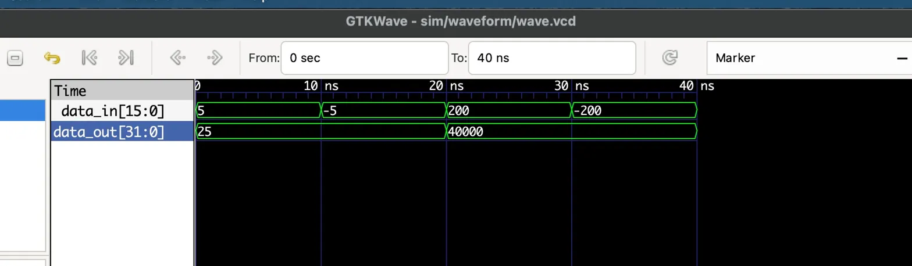
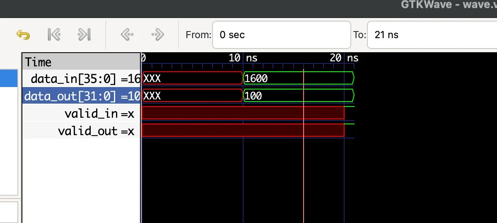
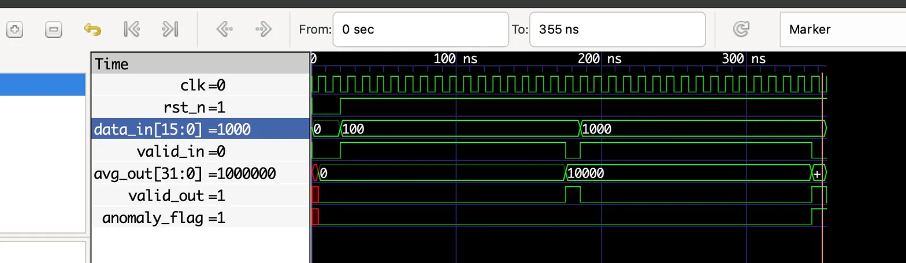

# RMS Anomaly Detection Digital IP

Synthesizable RTL IP core for vibration anomaly detection using
window-based RMS computation. Designed for FPGA implementation
on Intel Cyclone IV/V.

---

## Architecture
```
data_in [15:0] (signed)
      │
      ▼
┌──────────────┐  sq [31:0]   ┌─────────────┐  sum [35:0]   ┌───────────┐  avg [31:0]   ┌────────────┐
│ squaring_    │─────────────▶│ accumulator │──────────────▶│ shift_avg │──────────────▶│ comparator │──▶ anomaly_flag
│ unit (x²)   │              │ (Σ 16 samples)│              │ (>> 4)    │              │ (> threshold)│
└──────────────┘              └─────────────┘               └───────────┘              └────────────┘
                                    │                               │                        │
                               valid_out                       valid_out                valid_out
                           (pulse per window)
```

---

## Modules

### `squaring_unit`
Combinational. Computes x² for each 16-bit signed input sample.

| Port | Dir | Width | Description |
|------|-----|-------|-------------|
| `data_in` | input | 16-bit signed | Raw vibration sample |
| `data_out` | output | 32-bit | Squared result (always positive) |

### `accumulator`
Sequential. Accumulates 16 squared samples per window.

| Port | Dir | Width | Description |
|------|-----|-------|-------------|
| `clk` | input | 1 | System clock |
| `rst_n` | input | 1 | Active-low synchronous reset |
| `data_in` | input | 32 | Squared sample |
| `valid_in` | input | 1 | Input valid strobe |
| `data_out` | output | 36 | Sum of 16 squared samples |
| `valid_out` | output | 1 | Pulses HIGH when window complete |

### `shift_avg`
Combinational. Divides sum by N=16 using arithmetic right shift.

| Port | Dir | Width | Description |
|------|-----|-------|-------------|
| `data_in` | input | 36 | Sum from accumulator |
| `valid_in` | input | 1 | Pass-through valid |
| `data_out` | output | 32 | Mean square (sum >> 4) |
| `valid_out` | output | 1 | Pass-through valid |

> Shift-based averaging avoids costly divider circuits — synthesizes to zero LUTs.

### `comparator`
Combinational. Compares mean square against configurable threshold.

| Port | Dir | Width | Description |
|------|-----|-------|-------------|
| `data_in` | input | 32 | Mean square from shift_avg |
| `valid_in` | input | 1 | Pass-through valid |
| `anomaly_flag` | output | 1 | HIGH if data_in > THRESHOLD |
| `valid_out` | output | 1 | Pass-through valid |

Parameter: `THRESHOLD = 500000` (default, parameterizable)

### `rms_top`
Top-level. Connects all modules into a complete pipeline.

| Port | Dir | Width | Description |
|------|-----|-------|-------------|
| `clk` | input | 1 | System clock |
| `rst_n` | input | 1 | Active-low reset |
| `data_in` | input | 16 signed | Vibration sensor sample |
| `valid_in` | input | 1 | Input valid strobe |
| `avg_out` | output | 32 | Mean square output |
| `valid_out` | output | 1 | Output valid strobe |
| `anomaly_flag` | output | 1 | Anomaly detected flag |

---

## Project Structure
```
rms-anomaly-detection-ip/
├── src/
│   ├── squaring_unit.v      # x² combinational unit
│   ├── accumulator.v        # 16-sample window accumulator
│   ├── shift_avg.v          # Divide by 16 via >> 4
│   ├── comparator.v         # Threshold comparator
│   └── rms_top.v            # Top-level pipeline
├── tb/
│   ├── tb_squaring_unit.v   # Squaring unit testbench
│   ├── tb_accumulator.v     # Accumulator testbench
│   ├── tb_shift_avg.v       # Shift avg testbench
│   └── tb_rms_top.v         # Full pipeline testbench
├── img/
│   ├── waveform_squaring_unit.png
│   ├── waveform_accmulator.png
│   └── waveform_rms_top.png
└── README.md
```

---

## Simulation Results

### Top-level Pipeline (`tb_rms_top.v`)

| Test Case | Input | Expected avg_out | anomaly_flag | Result |
|-----------|-------|-----------------|--------------|--------|
| Normal signal | 16 × 100 | 10000 | 0 | ✅ PASS |
| Anomaly signal | 16 × 1000 | 1000000 | 1 | ✅ PASS |

### Unit Tests

| Module | Test | Expected | Result |
|--------|------|----------|--------|
| squaring_unit | +5 | 25 | ✅ |
| squaring_unit | -5 | 25 | ✅ |
| squaring_unit | +200 | 40000 | ✅ |
| squaring_unit | -200 | 40000 | ✅ |
| accumulator | 16 × 100 | 1600 | ✅ |
| accumulator | valid_out timing | pulse @ sample 16 | ✅ |
| shift_avg | 1600 >> 4 | 100 | ✅ |

---

## Simulation Waveforms

### Squaring Unit


### Accumulator


### Shift Avg


### Full Pipeline (RMS Top)


---

## Module Status

| Module | RTL | Testbench | Simulation |
|--------|-----|-----------|------------|
| squaring_unit | ✅ | ✅ | ✅ |
| accumulator | ✅ | ✅ | ✅ |
| shift_avg | ✅ | ✅ | ✅ |
| comparator | ✅ | — | ✅ (via top-level) |
| rms_top | ✅ | ✅ | ✅ |

---

## Tools

- **Simulation:** Icarus Verilog + GTKWave
- **Synthesis target:** Intel Cyclone IV/V (Quartus)
- **HDL:** Verilog RTL

---

## Design Notes

**Bit-width optimization:**
- Input: 16-bit signed
- After squaring: 32-bit (2× input width)
- After accumulation: 36-bit (32 + log2(16) = 32 + 4)
- After shift averaging: 32-bit

**Multiplier reuse:** Single `*` operator in squaring_unit
synthesizes to one DSP block on FPGA.

**Zero-cost division:** `>> 4` synthesizes to wire routing
only — zero LUTs, zero delay on critical path.

---

## Author

**Ho Minh Thao**
Electronics & Telecommunications Engineering — HCMUT
Interested in Digital IC Design, RTL Design, and VLSI Systems
